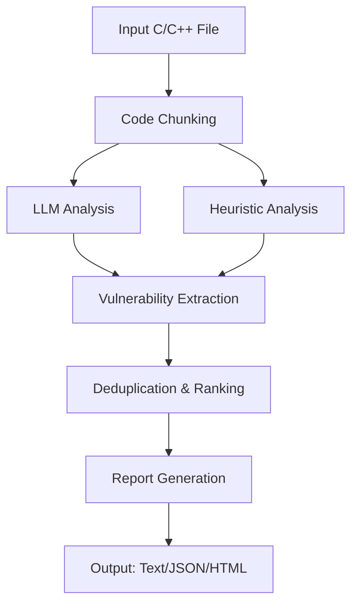

# C/C++ Vulnerability Analyzer
A comprehensive static analysis tool for detecting security vulnerabilities in C/C++ source code using both AI-powered analysis and rule-based heuristics.

## Features
- **Hybrid Analysis**: Combines AI-powered analysis (Phi-4 model) with rule-based vulnerability detection
- **Offline Operation**: Works completely offline after initial setup
- **Multiple Output Formats**: Text, JSON, and HTML reports
- **Comprehensive Coverage**: Detects buffer overflows, memory leaks, format string vulnerabilities, and more
- **Smart Chunking**: Intelligently splits large files for efficient analysis
- **Severity Classification**: Categorizes vulnerabilities by severity (Critical/High/Medium/Low)
- **Fix Suggestions**: Provides actionable remediation advice
- **CLI Interface**: Easy-to-use command-line interface

##  Architecture
The tool follows a modular architecture with clear separation of concerns:

```
vulnerability-analyzer/
├── main.py                     # CLI entry point and orchestration
├── setup_model.py              # Model setup and download script
├── src/
│   ├── analysis/
│   │   ├── llm_backend.py      # AI model integration (Phi-4)
│   │   ├── chunker.py          # Code chunking and preprocessing
│   │   ├── extractor.py        # Vulnerability pattern extraction
│   │   └── heuristics.py       # Rule-based analysis engine
│   └── report/
│       └── formatter.py        # Report generation and formatting
├── models/
│   └── phi-4/                  # AI model files (after setup)
└── tests/
    └── data/                   # Test files
```

### Core Components

1. **VulnerabilityAnalyzer** (`main.py`): Main orchestrator that coordinates all components
2. **ONNXLLMBackend** (`llm_backend.py`): AI-powered analysis using Microsoft's Phi-4 model
3. **CodeChunker** (`chunker.py`): Intelligent code segmentation for efficient processing
4. **HeuristicAnalyzer** (`heuristics.py`): Rule-based vulnerability detection
5. **VulnerabilityExtractor** (`extractor.py`): Pattern matching and vulnerability extraction
6. **ReportFormatter** (`formatter.py`): Multi-format report generation

### Analysis Pipeline



## Quick Start

### Prerequisites

- Python 3.8 or higher
- pip package manager
- Internet connection (for initial model setup only)

### Installation

1. **Clone the repository**:
   ```bash
   git clone <repository-url>
   cd vulnerability-analyzer
   ```

2. **Install dependencies**:
   ```bash
   pip install onnxruntime transformers onnxruntime-genai numpy
   ```

3. **Setup the AI model** (one-time, requires internet):
   ```bash
   python setup_model.py
   ```
   
   This downloads the necessary tokenizer files. For full AI capabilities, you'll also need to:
   - Download the Phi-4 ONNX model from [Hugging Face](https://huggingface.co/microsoft/phi-4)
   - Place the `.onnx` file in `models/phi-4/`

4. **Verify offline operation**:
   ```bash
   python test_offline.py
   ```

### Basic Usage

```bash
# Analyze a single file
python main.py vulnerable_code.c

# Verbose output with fixes
python main.py --verbose --fixes vulnerable_code.c

# Generate JSON report
python main.py --format json --output report.json source.cpp

# Rule-based analysis only (no AI model required)
python main.py --no-model vulnerable_code.c
```

### Advanced Usage

```bash
# Custom model path
python main.py --model ./custom_model input.c

# HTML report with fixes
python main.py --format html --output report.html --fixes vulnerable.c

# Configuration file
python main.py --config config.json input.c
```

## Supported Vulnerabilities

The analyzer detects various vulnerability types:

### Critical Severity
- **Buffer Overflows**: `gets()`, unsafe `strcpy()`, `strcat()`, `sprintf()`
- **Command Injection**: `system()`, `exec()`, `popen()` with user input

### High Severity
- **Use After Free**: Memory access after deallocation
- **Format String**: Unvalidated format strings in `printf()` family
- **Buffer Overflows**: Unsafe string operations

### Medium Severity
- **Memory Leaks**: Missing `free()` calls
- **Null Pointer Dereference**: Unchecked pointer access
- **Race Conditions**: Unsafe threading operations
- **Resource Management**: File operations without error checking

### Low Severity
- **Integer Overflow**: Potential arithmetic overflows
- **Weak Random**: `rand()` without proper seeding

## Output Formats

### Text Format (Default)
```
=== Vulnerability Analysis Report ===
File: vulnerable_code.c
Analysis Date: 2024-01-15 10:30:45

Line 15: [CRITICAL] Buffer Overflow - gets() function is unsafe and deprecated
Line 23: [HIGH] Use After Free - Variable 'ptr' used after free
Line 35: [MEDIUM] Memory Leak - malloc/calloc without corresponding free

=== Summary ===
Total vulnerabilities: 3
Critical: 1, High: 1, Medium: 1, Low: 0
Risk Score: 21
```

### JSON Format
```json
{
  "filename": "vulnerable_code.c",
  "vulnerabilities": [
    {
      "line": 15,
      "severity": "CRITICAL",
      "type": "Buffer Overflow",
      "description": "gets() function is unsafe and deprecated",
      "cwe": "CWE-120",
      "suggested_fix": "Replace gets() with fgets() and specify buffer size"
    }
  ],
  "statistics": {
    "total_vulnerabilities": 3,
    "risk_score": 21
  }
}
```

### HTML Format
Interactive HTML reports with syntax highlighting and detailed vulnerability information.

## Configuration

Create a `config.json` file for advanced configuration:

```json
{
  "analysis": {
    "max_chunk_size": 3000,
    "enable_llm": true,
    "confidence_threshold": 0.7
  },
  "output": {
    "include_context": true,
    "max_context_lines": 3
  },
  "vulnerabilities": {
    "ignore_patterns": ["test_", "debug_"],
    "severity_weights": {
      "CRITICAL": 10,
      "HIGH": 7,
      "MEDIUM": 4,
      "LOW": 1
    }
  }
}
```

## Troubleshooting

### Model Loading Issues
```bash
# Check if model files exist
ls -la models/phi-4/

# Test offline capability
python test_offline.py

# Use rule-based analysis only
python main.py --no-model file.c
```

### Performance Optimization
- Use `--no-model` for faster analysis on large codebases
- Adjust chunk size in configuration for memory optimization
- Use JSON output format for programmatic processing

### Common Issues

1. **"Tokenizer not found"**: Run `python setup_model.py` first
2. **"ONNX model not available"**: The tool works with rule-based analysis; download ONNX files for AI features
3. **Out of memory**: Reduce chunk size or use `--no-model` flag

## Exit Codes

The tool returns different exit codes based on findings:

- `0`: No vulnerabilities found
- `1`: Low/Medium vulnerabilities found
- `2`: High severity vulnerabilities found
- `3`: Critical vulnerabilities found
- `4`: Analysis error occurred

## Contributing

1. Fork the repository
2. Create a feature branch
3. Add tests for new functionality
4. Submit a pull request

## License

This project is licensed under the MIT License - see the LICENSE file for details.

## Acknowledgments

- Microsoft for the Phi-4 model
- ONNX Runtime team for efficient inference
- Security research community for vulnerability patterns

## References

- [CWE (Common Weakness Enumeration)](https://cwe.mitre.org/)
- [OWASP Top 10](https://owasp.org/www-project-top-ten/)
- [Microsoft Phi-4 Model](https://huggingface.co/microsoft/phi-4)